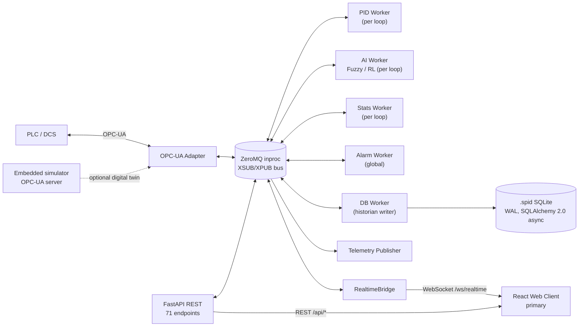

# PRD — Smart PID Edge Platform

**Type:** Whole-product specification, derived from source-code analysis.
**Status:** Describes the system as built on `main` at commit `3ccf5dc` (2026-07-30).
**Supersedes:** the previous revision of this document, which was scoped to a single initiative
(the web-frontend visual rewrite) and described that work as "Proposed." That initiative has since
shipped and merged to `main`, along with a second initiative (RL engine Ti/Ki optimization safety
fixes, "plan 001"). This revision documents the product as it exists in code today.

**Method.** This document was produced by reading the source tree directly — domain models, the
FastAPI router layer, the control/optimization engines, the web frontend, and the backend test
suite — rather than by summarizing `docs/smartPIDv2.md` (the original architecture spec) or the
prior PRD. Where code and docs disagree, code wins, and the disagreement is called out in
**§10 Known Gaps & Discrepancies**. Treat `docs/smartPIDv2.md` as historical intent, not current
truth, for any fact this document contradicts.

---

## 1. Product Summary

**Smart PID Edge Platform** is an industrial edge appliance that watches PID control loops running
on a PLC/DCS and continuously retunes their integral term (Ki or Ti) using either fuzzy logic or
online reinforcement learning, without requiring an engineer to hand-tune each loop. It doubles as
a lightweight loop historian, alarm manager, and performance-analytics tool.

- **Where it runs:** headless on an industrial PC wired to the plant network, next to (not inside)
  the PLC. It never takes over full PID execution unless explicitly configured to (see
  Supervisory vs. DDC, §5.1).
- **How operators reach it:** a browser, pointed at the edge PC. Nothing is installed on the
  operator's workstation.
- **Core value:** most industrial loops are tuned once at commissioning and never revisited; process
  dynamics drift, and performance degrades silently. This product closes that loop autonomously and
  makes the before/after improvement visible and auditable.

**Two runtime components, one of them frozen:**

| Component | Package | Role | Status |
|---|---|---|---|
| Core Engine | `smart_pid_core` | Headless backend daemon: PID math, AI tuning, OPC-UA I/O, alarms, historian, REST+WebSocket API | **Active** |
| Web Client | `smart_pid_web` | React/TypeScript browser client | **Active, primary** |
| Domain | `smart_pid_domain` | Shared models/enums/events/DTOs, zero infrastructure dependencies | **Active** (consumed by Core; HMI vendors its own copy of the wire contract) |
| Desktop HMI | `smart_pid_hmi` | PySide6 desktop client, predecessor to the web client | **Removed 2026-07-30** — see §5.14 |

---

## 2. Goals & Non-Goals

**Goals**
- Optimize the integral term of live PID loops continuously and safely, with guardrails that make
  a bad AI decision bounded rather than catastrophic.
- Run at the edge against real OPC-UA hardware, with resilient reconnection and no dependency on
  cloud connectivity.
- Give operators a single-pane real-time view of every loop plus alarms, with sub-second telemetry.
- Give engineers and plant managers evidence of AI impact (before/after KPIs) and full audit trail
  of every write to the process.
- Keep the browser client installable-free and the backend a single deployable daemon.

**Non-Goals (current release)**
- Multi-tenant or multi-site operation. One backend serves one plant; the network bind defaults to
  loopback.
- Cloud historian or centralized fleet management across multiple edge units.
- Full DCS/SCADA replacement. The platform assists an existing PLC/DCS; in Supervisory mode it
  never even computes PID output, only the integral adjustment.
- Access-control roles beyond two tiers (`admin`, `user`) — see §10 for the retired three-tier model.

---

## 3. Users & Personas

| Persona | Primary needs |
|---|---|
| **Process operator** | Monitor loops, change setpoint/mode, acknowledge alarms, stay authenticated, never lose visibility on a network blip. |
| **Control / instrumentation engineer** | Tune PID structure, configure AI strategy per loop, validate against the simulator before touching the real process, investigate multi-loop trends. |
| **Administrator** | Own OPC-UA connectivity, user accounts, project (`.spid`) lifecycle, alarm thresholds — everything that can destabilize the plant if misconfigured. |
| **Plant manager** | Wants plant-wide KPIs and AI ROI, not loop-by-loop detail. |
| **Sales engineer / evaluator** | Needs the product to look and feel like a modern industrial product in a demo, not legacy SCADA. |

---

## 4. System Architecture

Hexagonal (ports & adapters) + event-driven, two-package `uv` workspace (`smart_pid_core`,
`smart_pid_domain`), Python 3.13 backend + TypeScript/React frontend. `smart_pid_web` is excluded
from the Python workspace (it's an npm project). `smart_pid_hmi`, a third former workspace member,
was removed 2026-07-30 (§5.14).

| Layer | Package / module | Notes |
|---|---|---|
| Domain | `smart_pid_domain` | Pure dataclasses/StrEnums/pydantic DTOs. Zero infra deps (only `pydantic>=2.7`). No ports/protocols live here. |
| Application / ports | `smart_pid_core/application`, `domain/ports` | `LoopManager`, `EventBus`, workers, `Protocol`-based outbound ports (`ControlWriter`, `ControllerRepository`, `HistorianWriter`, `ProjectStore`). |
| Adapters (inbound) | `smart_pid_core/adapters/inbound` | FastAPI routers + WebSocket bridge, `SimulatorAdapter` + embedded `asyncua.Server`. |
| Adapters (outbound) | `smart_pid_core/adapters/outbound` | `OPCUAAdapter` (asyncua client), `SQLiteRepository`/`Historian`/6 more SQLAlchemy-2.0-async repos, `UserRepository` (raw aiosqlite, standalone `users.db`). |
| Web client | `smart_pid_web` | React 18 + Vite 5 + TypeScript 5 + Tailwind v4 + shadcn (via unified `radix-ui` package) + TanStack Query v5 + TanStack Virtual + uPlot. |
| Legacy client (removed) | `smart_pid_hmi` | Formerly PySide6 + pyqtgraph, consumed the legacy ZMQ `tcp://5555` PUB feed + REST. Removed 2026-07-30 (§5.14). |

**Communication channels**

| Channel | Transport | Direction | Purpose |
|---|---|---|---|
| Internal bus | ZeroMQ `inproc://`, XSUB/XPUB proxy, msgpack-free (plain bytes topics) | Backend-internal | 12 topic families (`TELEMETRY.{id}`, `STATUS.{id}`, `ACTION.CTRL.{id}`, `ACTION.AI.{id}`, `STATS.{id}`, `LOG.AI.{id}`, `PARAMS.{id}`, `CMD.AI.{id}`, `EVENT.ALARM.{id}`, `EVENT.SYSTEM`, `EVENT.TUNING_REC.{id}`, `SYS.RECONNECT.{id}`) route every worker-to-worker message. |
| Legacy telemetry bus | ZeroMQ `tcp://0.0.0.0:5555` (PUB), default port, msgpack | Backend → legacy HMI only | `TelemetryPublisher` republishes a **fixed allow-list** of 5 internal topic families (`STATUS.`, `ACTION.CTRL.`, `ACTION.AI.`, `EVENT.ALARM.`, `EVENT.SYSTEM`). Stats/AI-log/params never leave the process this way. |
| REST | FastAPI, `/api/*` in production (single-origin, served behind the SPA static mount) or bare `:8000` in dev | Web client ↔ backend | Commands, CRUD, history, project management, auth. 71 endpoints, see §6. |
| WebSocket | `GET /ws/realtime` | Backend → web client | Single envelope format `{type, loop_id, seq, ts, data}` fanning out 6 message kinds (status/action/ai/alarm/system/stats). Token-authenticated first-frame handshake. |

---

## 5. Functional Requirements

Requirement IDs are grouped by domain and are stable identifiers for cross-referencing gaps in
§10, not a claim of exhaustive coverage.

### 5.1 Control Engine & Loop Modes (`CTL`)

- **CTL-1.** Every loop runs a velocity-form PID algorithm
  (`ΔCV = Kp·[(e−e₁) + dt/Ti·e − Td·(pv−2pv₁+pv₂)/dt]`) with independent PV and SP input filters,
  a low-flow cutoff, two-layer anti-windup (local saturation + directional, driven by the
  downstream `BKCAL_IN` limit bits), 16× accelerated integral-recovery after unsaturation, optional
  feedforward, and an optional 10% output over-range for BKCAL_OUT signaling.
- **CTL-2.** Two execution modes per loop: **Supervisory** (PID resides on the PLC; the backend
  writes only the AI-adjusted integral term) and **DDC** (backend executes the complete PID
  equation and writes CO directly). Supervisory is the default; DDC unlocks additional
  configuration fields (Tuning, Scaling & Limits, Filters & IO, Shed & Safety, PID Structure,
  Integral Type) that stay hidden in Supervisory.
- **CTL-3.** Nine controller modes, mirroring Foundation-Fieldbus PID block conventions:
  `OOS` (out of service — frozen, no-op), `IMan` (initialization manual / external tracking),
  `LO` (local override), `Man` (manual), `Auto` (automatic), `Cas` (cascade), `RCas` (remote
  cascade), `ROut` (remote output), and `Bypass` (SP passed directly to CO, clamped, bumpless).
  Mode transitions are gated by a `permitted_modes` allow-list per loop, forced-transition priority
  rules (tracking active → LO; bad PV quality → Man; bad/uninitialized cascade feedback while in
  Cas/RCas → IMan; shed-timeout expiry → configured shed mode, default Man), and a cascade
  handshake state machine (NI/IR/IA/GOOD_CASCADE) for Foundation-Fieldbus-style cascade
  initialization.
- **CTL-4.** Bumpless transfer on every mode change that would otherwise step the output.
- **CTL-5.** Configurable scan rate per loop (`scan_rate_s`), independent of the AI cadence.
- **CTL-6.** Anti-reset-windup limits (`arw_hi_lim`/`arw_lo_lim`) are configurable independently of
  the output limits.
- **CTL-7.** Per-loop shed behavior: on connection loss, the loop transitions to a configured shed
  mode (default `Man`) after a configurable timeout.
- **CTL-8.** SP and output rate limits (`sp_rate_up`/`sp_rate_dn`) are configuration fields exposed
  end-to-end through the API and persisted — **not enforced at runtime today** (§10, G1).

### 5.2 AI-Assisted Tuning (`AI`)

- **AI-1.** Each loop independently selects one of three tuning strategies: `NONE`, `FUZZY`, `RL`.
- **AI-2.** Each loop selects one of three control objectives, which changes the AI's tuning
  behavior qualitatively:
  - **SP Tracking** — reach the new setpoint fast without overshoot.
  - **Disturbance Rejection** — minimize offset from a fixed setpoint as fast as possible when an
    external force perturbs the process.
  - **Surge Level** — let the PV float within a wide band and only react near the extremes, to
    keep a buffering vessel's control valve quiet.
- **AI-3. Fuzzy engine.** Hand-rolled (no external fuzzy-logic library) Mamdani-min-max /
  singleton-centroid-of-gravity inference. **Not** a single universal 7-level Error/ΔError engine —
  it is three independent per-objective strategy classes, each consuming 2–3 domain-specific
  indicators computed from the rolling statistics window (SP Tracking: IAE, oscillation, control
  effort, 14 rules; Disturbance Rejection: an event-driven IDLE→ACTIVE→SETTLING state machine
  tracking peak error, recovery time and residual oscillation, 10 rules, with limit-cycle escape
  and multi-directional overshoot detection; Surge Level: continuous margin/valve-TV/approach-rate
  indicators, 9 rules, the widest output clamp of the three). Output is a bounded adjustment
  `γ ∈ [−1, +1]` (or a narrower/wider per-objective clamp).
- **AI-4. RL engine.** Soft Actor-Critic (SAC) only, via the optional `stable-baselines3` extra
  (lazy-imported; the extra is **not** installed by default — see §10, G3). 5-dimensional
  observation space `[error, delta_error, CO, integral_val, ti_norm]`, where `ti_norm` is the
  current gain's log-scale position within its configured guardrail range (required for the
  observation to be Markovian). Online learning: every training tick replays recent transitions
  into the SAC model and takes a gradient step; state (replay buffer + model) is persisted
  periodically and restored on restart.
- **AI-5. Policy safety gate.** A freshly-initialized RL model may not act until it has completed
  3 successful online training rounds; before that (and whenever training itself fails), the engine
  falls back to a deterministic P+D+I heuristic with an oscillation-override mode. A model restored
  from a previously-trained persisted state is trusted immediately — the gate only protects against
  a randomly-initialized network driving a live loop.
- **AI-6. Reward.** Prefers a reward computed from the rolling statistics window (mean error,
  oscillation, valve travel) when enough samples exist; falls back to a single-sample
  instantaneous reward otherwise. Reward shape is per-objective (SP Tracking / Disturbance
  Rejection minimize IAE/ITAE and penalize valve chatter; Surge Level rewards a quiet valve and
  only penalizes error outside the dead-band).
- **AI-7. Common update rule and guardrails.** Both engines produce the same bounded
  `γ ∈ [−1, +1]` signal, converted to a gain update
  `Ki_new = Ki_current · (1 + γ · speed_factor)` (sign inverted for Ti, since Ti and Ki move in
  opposite directions for the same control intent). The result is always clamped to a per-loop
  `[ai_limit_min, ai_limit_max]` guardrail before being written anywhere.
- **AI-8. Cadence.** The AI cycles at `3 × TSS` seconds (TSS = "time to steady state", a
  per-loop-configurable field, default 60 s) — independent of the PID scan rate and hot-reloadable
  without restarting the loop.
- **AI-9. Gating.** The AI only acts when: the loop's AI engine is not `NONE`; the optimizer is
  enabled (`optimization_enabled`, independently toggle-able from Man/Auto, requirement AI-13);
  the worker is not paused; and the loop's live mode (as reported by the PID worker itself, not
  the raw PLC telemetry) is `Auto`, `Cas`, or `RCas`.
- **AI-10. Explainability.** Every AI adjustment is logged with a reasoning string to
  `Log_Sintonia_IA` and pushed live over the event bus, so operators see *why* a gain changed, not
  just that it did.
- **AI-11. Full-retune recommendations.** Independently of the continuous per-cycle nudge, the AI
  worker periodically attempts full FOPDT (first-order-plus-dead-time) process identification via
  steady-state gain estimation, and if it finds a materially different tuning than what's live,
  synthesizes a complete Kp/Ti/Td recommendation via IMC/lambda tuning. This recommendation is
  **never auto-applied** — it is surfaced to an administrator, who must explicitly confirm before
  it is written to the process (guardrail-clamped like any other tuning write). Available only for
  loops using `TIME_TI` (not `GAIN_KI`) integral convention.
- **AI-12.** Operators can Start / Stop / Pause the AI worker per loop, independent of PID Man/Auto.
  Pause preserves engine state (replay buffer, trained model); Stop disables the worker entirely.
- **AI-13.** The optimizer (online tuning) can be enabled/disabled per loop independent of the
  loop's Man/Auto mode, so an engineer can isolate the optimizer without taking the loop off Auto.
- **AI-14.** All tuning writes (continuous nudge and full-retune) are clamped server-side to a
  configurable `max_tuning_change_pct`, so a bad AI decision or a fat-fingered manual value cannot
  step a live loop's gains arbitrarily.

### 5.3 OPC-UA Integration (`OPC`)

- **OPC-1.** Async OPC-UA client (`asyncua`) per backend instance, own thread + private event loop.
  Connection state machine: `OFFLINE → CONNECTING → ONLINE → RECONNECTING → CONNECTING`, exponential
  backoff, background watchdog polling server status every 5 s.
- **OPC-2.** Foundation-Fieldbus-style signal quality (severity + limit bits + cascade sub-status)
  is decoded from the standard OPC-UA `StatusCode` bits, not a custom protocol field.
- **OPC-3.** Every controller has a `TagBindings` configuration (11 NodeID strings: PV, SP, CO,
  integral, BKCAL in/out, Kp, Ti, Td, mode target, mode actual, plus a mode-value integer map) that
  maps the platform's internal signals onto PLC NodeIDs. Updating tag bindings hot-reloads the live
  adapter registration.
- **OPC-4.** A searchable, virtualized tag browser lets an administrator explore the PLC's address
  space (depth-capped DFS, debounced search) instead of memorizing NodeIDs by hand — reused both
  standalone and inside the loop configuration dialog's tag picker.
- **OPC-5.** Writes to PID parameters and target mode are verified: the adapter reads the value back
  ~1.5 s after writing and retries (up to 2 more attempts) on mismatch, silently protecting against
  a dropped DCS write the caller never explicitly awaits.
- **OPC-6.** After a reconnect, the platform performs a bumpless resync rather than stepping the
  output.
- **OPC-7.** The tag browser is unavailable in simulator mode by product decision (not a technical
  limitation — the simulator's own embedded OPC-UA server is perfectly browsable).

### 5.4 Digital Twin / Simulator (`SIM`)

- **SIM-1.** A first-principles-adjacent process simulator (SciPy-signal-based FOPTD/SOPTD transfer
  functions with Padé dead-time approximation) can stand in for a real PLC, letting an engineer
  validate AI tuning behavior before touching the real process.
- **SIM-2.** Four built-in process presets (Flow, Pressure, Level, Temperature) plus a fully custom
  transfer function (gain, two time constants, dead time).
- **SIM-3.** The simulator is not a special-cased telemetry shortcut: it hosts a **real embedded
  OPC-UA server**, and the platform's control workers connect to it through the exact same
  `OPCUAAdapter` client code path used for a real DCS — "simulator mode" exercises the entire real
  network/adapter stack.
- **SIM-4.** Disturbance injection: step load disturbances and measurement noise, both manual and
  automatic (randomized recurring excitation) for unattended robustness testing.
- **SIM-5.** Automatic setpoint walking (bounded random SP changes) for unattended stress testing,
  independent of automatic disturbance injection.
- **SIM-6.** The simulator exposes its own internal test PID (enable/params/setpoint/mode/CO) so an
  engineer can validate the simulated process dynamics in isolation before wiring the platform's own
  control loop to it.
- **SIM-7.** Simulator-originated configuration changes (an external OPC-UA client writing Kp/Ti/Td/
  mode/setpoint directly to the simulator's exposed nodes) are tracked as dirty and periodically
  persisted, so AI-tuned values applied through the simulator path become durable across restarts.

### 5.5 Alarming (`ALM`)

- **ALM-1.** Six alarm types per loop: `HIHI`, `HI`, `LO`, `LOLO` (absolute PV thresholds) and
  `DV_HI`, `DV_LO` (deviation from setpoint).
- **ALM-2.** Each alarm type is a full hysteresis + deadband + independent on-delay/off-delay state
  machine per `(controller, alarm_type)` pair — not a bare threshold crossing.
- **ALM-3.** Four visual priorities: `CRITICAL`, `WARNING`, `ADVISORY`, `LOG` (the last recorded but
  not surfaced in the live alarm banner).
- **ALM-4.** Alarms surface in two places simultaneously: the header of the affected loop's card,
  and a persistent alarm footer bar visible from every page, with counts by severity.
- **ALM-5.** Acknowledgement (ACK) does not clear an alarm — it only silences the blinking
  indication. An alarm disappears from the active list only when the underlying process condition
  actually returns to normal. Individual ACK and bulk "ACK ALL" are both available.
- **ALM-6.** Alarm state is revalidated against the backend after every acknowledgement so the
  client never diverges from server truth.
- **ALM-7.** Alarms persist to a 30-day history, independent of the 7-day process-value retention
  (§5.7).
- **ALM-8.** Alarm limits, priorities, deadband and on/off-delay are configurable per loop by an
  administrator and hot-reload the live alarm evaluator without a restart.

### 5.6 Statistics (`STA`)

- **STA-1.** Per-loop rolling-window performance metrics computed server-side and pushed to the
  client, so numbers are consistent across every consumer: IAE, ITAE, ISE, MSE, standard deviation,
  Total Variation (valve travel), variability relative to span and to setpoint, plus oscillation
  diagnostics (peak-to-peak error, reversal count, zero-crossing count, and a composite oscillation
  score) that both the Fuzzy engine and the UI consume.
- **STA-2.** The statistics window is sized to 5× the loop's configured TSS and republished on a
  roughly 5-second cadence, independent of the loop's own scan rate.
- **STA-3.** A setpoint-step settling cooldown excludes the post-step transient from oscillation
  metrics (so a deliberate SP change is never mistaken for instability) while still counting it in
  the error-integral metrics.

### 5.7 Historian, Retention & Project Management (`HIST` / `PROJ`)

- **HIST-1.** Process telemetry (PV/SP/CO/integral) is buffered in memory and flushed to SQLite in
  batches (~every 5 s) rather than written per-sample, to keep the write-hot path cheap under WAL.
- **HIST-2.** Process history retains 7 days; alarm history and system-event history retain 30 days;
  cleanup runs once daily.
- **HIST-3.** A project is a single portable SQLite file (`.spid`) containing every controller
  configuration, historian data, alarm/AI/audit logs, and simulator configuration for one plant.
  It resides exclusively on the backend; the web client never touches it directly.
- **PROJ-1.** Full project lifecycle from the client: list, create new, open (switches the active
  project and starts every loop it contains), import (multipart upload with a 3-gate validation —
  file-format sniff, expected-table check, full schema-compatible open on a staging copy — before
  the file is accepted), download (WAL-checkpointed first, so the download is never missing pending
  writes), and delete (refused for the currently-open project).
- **PROJ-2.** Uploaded `.spid` files are size-capped (2 GiB default) and rejected if accepting them
  would drop free disk below a configured floor (1 GiB default); destination paths are sanitized
  against traversal.
- **PROJ-3.** A first-run welcome screen lists available projects post-login so an administrator
  can resume where they left off, shown once per session.

### 5.8 Authentication & RBAC (`AUTH`)

- **AUTH-1.** Two roles: `admin` (full access) and `user` (operate + acknowledge, no configuration).
  The three-tier Admin/Supervisor/Operator model described in the original architecture document
  was retired; legacy role values and legacy JWTs are rejected and migrated one-time at startup.
- **AUTH-2.** JWT (HS256) issued on login, default 8-hour expiry, required secret configured via
  environment (the daemon refuses to start without it).
- **AUTH-3.** Authorization is **re-derived from the database on every request**, not trusted purely
  from the JWT payload — a demoted or deactivated account loses access on its very next call, not
  after the token's natural expiry.
- **AUTH-4.** Credentials live in a standalone user database, physically separate from any `.spid`
  project file, so importing or sharing a project can never leak or overwrite accounts.
  Passwords are bcrypt-hashed.
- **AUTH-5.** A default `admin`/`admin` account is seeded on first boot if the user database is
  empty, with a logged warning to change it immediately.
- **AUTH-6.** All user management (create, change role/password, deactivate) is admin-only. There
  is no self-service registration.
- **AUTH-7.** The system refuses to demote or deactivate the last remaining active admin account.
- **AUTH-8.** Every mutating command (setpoint, mode, output, tuning, optimizer toggle, alarm ACK,
  config changes, user management) is authorized independently on the backend — hiding a control in
  the UI is a convenience, never the security boundary.
- **AUTH-9.** The client mirrors the same permission model locally (13 capability actions covering
  view, alarm ACK, loop operate, data export, tuning edit, AI control, controller management, alarm
  configuration, OPC-UA configuration, project management, user management, settings, simulator
  configuration) purely for UI presentation (disable/hide controls); it is explicitly redundant with
  server-side enforcement, never a substitute for it.

### 5.9 Audit Trail & System Events (`AUD`)

- **AUD-1.** Every state-changing command (setpoint/mode/output change, tuning write, alarm ACK,
  AI start/stop/pause, alarm/AI config change, controller/user CRUD, simulator/OPC-UA config
  change) is recorded to an audit log with old value → new value, and simultaneously emitted as a
  live system event so any connected client's event feed shows it in real time.
- **AUD-2.** The audit trail is queryable by date range, user, and action type, admin-only.
- **AUD-3.** A separate system-event feed (backend lifecycle events plus every audited user action)
  is available to any authenticated user, filterable by source and severity.

### 5.10 Web Frontend Surfaces (`WEB`)

Ten routed pages plus overlay dialogs, driven by one route registry that projects into both the top
navigation and the admin config menu:

| Route | Purpose | Access |
|---|---|---|
| `/login` | Authentication | Public |
| `/` (Dashboard) | Horizontal loop-card strip, trend panel, faceplate rail, KPI band, persistent alarm footer. The default landing page. | Any session |
| `/multitrend` | 2×2 synced-time-range multi-loop trend grid (up to 4 series), history replay, CSV export | Any session |
| `/alarms` | Tabs: Active, History, Configuration (configuration tab admin-gated) | Any session |
| `/simulator` | Digital-twin control panel + trend | Any session (twin operate is a `user`-level capability) |
| `/executive` | Plant-wide KPI dashboard: coverage, bad-actor ranking, AI ROI, backend health | Any session |
| `/projects` | `.spid` project CRUD (create, drag-drop import, open, download, delete) | Admin only |
| `/settings` | Local browser preferences (trend window default, numeric decimals, destructive-action confirmation) — not server configuration | Admin only |
| `/connection` | OPC-UA endpoint connect/disconnect + tag browser | Admin only |
| `/users` | User roster: create, edit role/password, deactivate/reactivate | Admin only |

Overlay surfaces (no dedicated URL): loop configuration dialog (778-line modal covering
identification, execution mode, PID tuning, scaling/limits, tag bindings, AI configuration, with a
type-the-name delete confirmation, read-only for `user` role); AI tuning recommendation confirm
dialog (current-vs-recommended Kp/Ti/Td, requires explicit confirm before any write); the post-login
welcome/project-chooser overlay.

- **WEB-1.** One WebSocket connection per session; every card, trend, and KPI updates in real time
  from the same stream.
- **WEB-2.** Reconnect uses exponential backoff (500 ms → 10 s cap); an invalid/expired token closes
  the socket permanently and forces re-login rather than retrying.
- **WEB-3.** After any reconnect, or on a detected sequence-number gap while connected, the client
  resynchronizes state over REST (controllers, active/history alarms since last-seen timestamp,
  per-loop AI status, OPC-UA/simulator status) and primes the query cache directly, so nothing is
  silently missed.
- **WEB-4.** A dual-threshold dead-link watchdog distinguishes "numbers are stale" (6 s since last
  render) from "the socket is actually dead" (12 s since last frame arrival, triggers a forced
  reconnect) — because a socket can remain technically open while silently dead behind a proxy/NAT.
- **WEB-5.** A late-mounting component is immediately handed the last-seen frame for its
  `(type, loop_id)` instead of rendering blank until the next tick.
- **WEB-6.** A backgrounded/inactive tab drops stale frames rather than replaying a backlog when it
  regains focus.
- **WEB-7.** All server-state is TanStack Query; all writes are REST (never over the WebSocket), and
  a successful write invalidates the relevant query so the server is the source of truth for the
  post-write state, not an optimistic client guess.
- **WEB-8.** Frontend types are generated from the backend's live OpenAPI schema and drift-checked
  in the build pipeline, so a backend contract change becomes a compile error in the client, not a
  silent runtime mismatch.
- **WEB-9.** Every process value renders in tabular/monospaced numerals with aligned decimals so
  digits don't visually jump while being read.
- **WEB-10.** WCAG AA contrast (4.5:1 text / 3:1 non-text), visible focus rings, 44×44px minimum
  touch targets, and `prefers-reduced-motion` handling (blink → underline+bold) are enforced across
  every theme by automated tests, not spot-checked manually.

### 5.11 Visual Identity / Theming (`THM`)

Six themes ship, all satisfying one 60-token contract so no component branches on theme identity:

| Theme | Nature | Notes |
|---|---|---|
| `optimizer` | **Default.** Light, LFR Automação-branded "Painel Executivo" direction | Only theme (with its dark sibling) carrying a distinct brand layer (KPI band, brand accent) separate from the interactive accent color |
| `optimizer-dark` | Dark sibling of `optimizer`, "Comando IA" direction, amber promoted to the interactive accent | Same geometry as `optimizer` |
| `recorder` | Light instrument skin — strip-chart recorder aesthetic | Legacy of the prior rewrite phase, retained as an alternate skin |
| `phosphor` | Dark instrument skin — CRT/control-room aesthetic | 4px glow on live traces |
| `isa101` | ISA-101-compliant skin (neutral grays, color reserved for alarms) | For buyers whose site HMI policy mandates the standard |
| `neon` | High-contrast skin that deliberately breaks ISA-101 color doctrine | 8px glow; exists precisely because the other five stay ISA-101-safe |

- **THM-1.** Components consume semantic design tokens exclusively — a build-time guard test fails
  if any raw color literal (`#rrggbb`, `rgb()`, `hsl()`, `oklch()`, arbitrary Tailwind color
  utility) appears anywhere under `src/`.
- **THM-2.** Theme choice persists per-browser and survives across sessions; unrecognized/legacy
  stored values (from themes dropped in an earlier phase) migrate to `optimizer`.
- **THM-3.** PV/SP/CO trace color convention (PV high-contrast, SP dashed as a reference, CO on the
  secondary axis) is constant across every theme; alarm colors are never reused as trace colors.
- **THM-4.** Typography: Poppins (display, 5 of 6 themes), Inter Variable (UI text), IBM Plex Mono
  (every numeric process value), Orbitron (display face, `neon` theme only) — self-hosted, Latin
  subset, no external font CDN.

### 5.12 Export (`EXP`)

- **EXP-1.** Single-loop trend data exports to CSV client-side, synchronously, from the currently
  plotted window — no backend round-trip.
- **EXP-2.** Multi-loop / arbitrary date-range export runs as a backend background job
  (`POST /export`, polled, then downloaded as an authenticated file), so a large export never blocks
  the UI.
- **EXP-3.** Export formats today: **CSV and JSON only.** PDF report generation and plant-wide
  (multi-controller) export are **not implemented** — see §10, G4.

### 5.13 Executive Dashboard (`EXEC`)

- **EXEC-1.** Plant-wide KPIs: percentage of loops in Auto, AI coverage percentage.
- **EXEC-2.** Worst-performing loops ranked ("bad actors"), deep-linking to that loop on the main
  dashboard.
- **EXEC-3.** Before/after AI comparison and backend health (CPU/RAM/uptime) surfaced for a
  plant-manager audience distinct from the operator dashboard.
- **EXEC-4.** All KPI aggregation is client-side, computed from the same `/controllers`,
  `/controllers/stats`, and `/alarms/active` data the operator dashboard already fetches — there is
  no dedicated backend KPI endpoint (§10, G8).

### 5.14 Legacy Desktop Client — PySide6 HMI (removed 2026-07-30)

- **HMI-1.** `smart_pid_hmi` was a complete, working 8-screen PySide6 desktop application
  (~1,700-line main window, toolbar navigation, theming, full alarm/simulator/OPC-UA/user wiring),
  frozen since 2026-04-13 (last feature work) with no active users once the web client shipped.
- **HMI-2.** Removed in `f30fba6` ("chore(hmi): remove legacy PySide6 desktop client"): deletes
  `packages/smart_pid_hmi/` (46 files) and `tests/hmi/` (54 files), drops PySide6/pyqtgraph/
  pytest-qt/shiboken6 from the `uv` workspace. The web client is the sole GUI client from this
  commit forward.
- **HMI-3.** `TelemetryPublisher` (`smart_pid_core`) still binds a ZMQ PUB socket on
  `tcp://0.0.0.0:5555` for the retired HMI's telemetry feed — this port now has no consumer and is
  dead infrastructure, not yet removed.

---

## 6. API Surface Summary

FastAPI backend, 71 REST endpoints across 15 routers plus one WebSocket route, all mounted by a
single `create_app()` factory. The canonical, always-current contract is the live OpenAPI schema
(`GET /openapi.json`, dumped by `scripts/dump_openapi.py` and consumed by the web client's codegen
pipeline) — the table below is a navigational summary, not the contract of record.

| Router | Prefix | Endpoints | Auth | Covers |
|---|---|---|---|---|
| system | `/system` | 1 | none | Health probe (uptime, active loop count, CPU/RAM) — the only route with zero auth |
| auth | `/auth` | 3 | none / user | Login, token refresh, "who am I" |
| controllers | `/controllers` | 7 | user (read) / admin (write) | Controller CRUD + per-loop alarm-threshold sub-resource; PID params and AI config are fields on this DTO, not separate routers |
| stats | `/controllers` | 2 | user | Rolling-window performance metrics, all loops or one |
| ai | `/controllers` | 5 | user (read) / admin (write) | Per-loop AI status/history/start/stop/pause |
| commands | `/commands` | 7 | user / admin | Setpoint, mode, manual output, optimizer toggle, direct tuning write, tuning-recommendation read/apply |
| alarms | `/alarms` | 5 | user | Active list, history, AI-log history, ACK, ACK-all |
| audit | `/audit` | 1 | admin | Full audit trail query |
| system_events | `/system-events` | 1 | user | System/lifecycle event feed |
| history | `/history` | 1 | user | Trend/history query for one controller |
| export | `/export` | 3 | user | Background export job create/status/download (CSV/JSON only) |
| opcua | `/opcua` | 6 | user (status) / admin (rest) | Connection status, browse, search, endpoint config, connect, disconnect |
| simulator | `/simulator` | 18 | user (3 operate routes) / admin (rest) | Largest router — twin lifecycle, embedded OPC-UA server, presets, disturbances, per-loop simulator-internal PID |
| project | `/project` | 7 | user (current) / admin (rest) | `.spid` list/new/open/import/download/delete |
| users | `/users` | 4 | admin | User roster CRUD (soft-delete only) |
| **realtime** | `/ws/realtime` | 1 (WS) | token handshake | Live push: status/action/ai/alarm/system/stats envelopes |

**Security posture on the API itself:** JWT Bearer auth on every route except the health probe;
role is re-checked against the database on every call, not just decoded from the token; CORS,
`TrustedHost`, and a restrictive Content-Security-Policy are applied as middleware, with
`TrustedHost` registered to run outermost so a bad `Host` header is rejected before any other
processing. `/docs`, `/redoc`, and `/openapi.json` are reachable without authentication (§10, G9).

---

## 7. Data Model Summary

The domain layer defines two parallel representations that are deliberately not the same classes:
**models** (mutable/frozen dataclasses, used internally by the engines and the event bus) and
**DTOs** (pydantic `BaseModel`s, used only at the FastAPI request/response boundary). 23 `StrEnum`
classes, 11 frozen domain events, a 23-class exception hierarchy rooted at `SmartPIDError`
(`DomainError` / `InfrastructureError` / `CommunicationError` / `ProjectError` /
`AuthenticationError` / `AuthorizationError`), and roughly 65 DTO classes across 14 files back this.

**`Controller`** is the central aggregate — 41 fields, grouped:

| Group | Fields |
|---|---|
| Identity | id, name, description |
| Execution / timing | execution_mode, scan_rate_s, tss_s, process_speed, process_type |
| PID structure/tuning | pid_params (Kp/Ti/Td/derivative-filter/deadband), pid_structure (ISA/Parallel/Series), integral_type (Gain-Ki / Time-Ti) |
| Scaling | pv_scale, out_scale (each: EU min/max/unit) |
| OPC-UA bindings | tag_bindings (11 NodeIDs + mode-value map) |
| Option words | control_opts (11 flags), io_opts (6 flags), status_opts (2 flags) |
| AI configuration | ai_config (engine, objective, dead-time estimate, guardrail min/max, RL hyperparameters), optimization_enabled, tuning_write_mode, max_tuning_change_pct |
| Mode / tracking | track_opt, permitted_modes, mode_normal, shed_opt, shed_time_s, trk_in_d |
| Setpoint limits | sp_hi_lim, sp_lo_lim, sp_rate_up, sp_rate_dn |
| Output limits | out_hi_lim, out_lo_lim |
| Anti-reset-windup | arw_hi_lim, arw_lo_lim |
| Filters | pv_ftime, sp_ftime |
| Low cutoff | low_cut |
| Feedforward | ff_enable, ff_gain |
| Alarms | alarm_config (31-field record: 6 alarm types × 5 fields + shared deadband) |

**Key enumerations** (full list of 23 in code; the product-relevant ones):

| Enum | Values |
|---|---|
| `ControllerMode` | OOS, IMan, LO, Man, Auto, Cas, RCas, ROut, Bypass (9) |
| `AIEngine` | NONE, FUZZY, RL |
| `ControlObjective` | SP_TRACKING, DISTURBANCE_REJECTION, SURGE_LEVEL |
| `ProcessSpeed` | ULTRA_FAST, FAST, MEDIUM, SLOW (drives suggested statistics-window/AI-cadence presets) |
| `UserRole` | admin, user |
| `AlarmPriority` | CRITICAL, WARNING, ADVISORY, LOG |
| `AlarmType` | HIHI, HI, LO, LOLO, DV_HI, DV_LO |
| `ConnectionState` | OFFLINE, CONNECTING, ONLINE, RECONNECTING |

**Persistence.** Each project is one SQLite (WAL) file. Table names remain the original Portuguese
names (`Controladores`, `Log_Processo`, `Log_Sintonia_IA`, `Log_Alarmes`, `Log_Auditoria`,
`Configuracao_Alarmes`, `Configuracao_Simulador`, `Projeto_Meta`, `Modelos_IA`,
`Log_System_Events`); user credentials live in a separate standalone `users.db` with its own
`Usuarios` table. Six of seven repositories are ported to SQLAlchemy 2.0 async; `UserRepository`
remains raw `aiosqlite` by design (§10, G2).

---

## 8. Non-Functional Requirements

**Performance / timing**
- PID scan rate is configurable per loop (default 1 s).
- AI tuning cadence: `3 × TSS` seconds per loop (TSS default 60 s), hot-reloadable.
- Statistics window: `5 × TSS` samples, republished roughly every 5 s.
- Historian batch flush: ~every 5 s; process retention 7 days, alarm/system-event retention 30 days
  (§10, G6 — the retention numbers are correct in practice but are hardcoded, not settings-driven).
- Simulator tick: 100 ms default.

**Security**
- JWT (HS256, 8h default expiry) + bcrypt password hashing; role/active-flag re-derived from the
  database on every request.
- Backend binds to `127.0.0.1` by default (code default; see §10, G10 for a checked-in dev-file
  divergence).
- CORS / TrustedHost / CSP middleware on every response; WebSocket handshake enforces an allowed-
  origin list separately from CORS.
- No rate limiting or lockout on the login endpoint (§10, G9).
- `.spid` import path is sanitized against traversal and validated (magic bytes → expected table →
  full schema-compatible open) before being accepted.

**Deployment topology**
- Single backend process (`smart-pid-core` console script) per plant, one FastAPI/uvicorn server,
  one ZeroMQ proxy thread, up to 3 worker threads per active loop plus ~7 global worker threads.
- The web client is served two ways: single-origin production (built assets mounted by the backend
  itself, last in the route table so it never shadows the API) or a separate Vite dev server proxying
  `/api` and `/ws` to the backend in development.

**Key environment variables** (`SPID_` prefix, `pydantic-settings`)

| Variable | Default | Purpose |
|---|---|---|
| `SPID_JWT_SECRET` | — (required, daemon exits without it) | JWT signing secret |
| `SPID_JWT_EXPIRY_HOURS` | 8 | Token lifetime |
| `SPID_LOG_LEVEL` | INFO | Log verbosity |
| `SPID_OPCUA_ENDPOINT` | `opc.tcp://localhost:4840` | Default PLC endpoint |
| `SPID_API_HOST` / `SPID_API_PORT` | `127.0.0.1` / `8000` | REST/WS bind — loopback by default |
| `SPID_ZMQ_PUBLISH_PORT` | 5555 | Legacy telemetry PUB port (HMI only) |
| `SPID_SIMULATOR_ENABLED` / `SPID_SIMULATOR_PORT` | false / 4849 | Digital twin + its embedded OPC-UA server |
| `SPID_PROJECTS_DIR` | `~/.smart-pid/projects/` | Where `.spid` files live |
| `SPID_USERS_DB_PATH` | `~/.smart-pid/users.db` | Standalone credentials store |
| `SPID_MAX_UPLOAD_BYTES` / `SPID_MIN_FREE_DISK_BYTES` | 2 GiB / 1 GiB | Project-import guardrails |
| `SPID_CORS_ALLOW_ORIGINS` / `SPID_TRUSTED_HOSTS` / `SPID_ALLOWED_WS_ORIGINS` | dev-friendly defaults | Network security middleware |
| `SPID_DB_RETENTION_PROCESS_DAYS` / `SPID_DB_RETENTION_ALARM_DAYS` / `SPID_DB_FLUSH_INTERVAL_S` / `SPID_DB_BATCH_SIZE` | 7 / 30 / 5.0 / 500 | **Declared but not wired to runtime behavior** — see §10, G6 |
| `SPID_EXECUTION_MODE` | monitor | System-wide monitor-vs-execute gate |

---

## 9. Testing & Quality

- **Backend:** 167 pytest files under `tests/` (`pytest-asyncio`), spanning domain (13), core unit
  (51), core integration (54), API contract (2), and the legacy HMI (47, still exercised via
  `pytest-qt` despite the freeze). Rough per-area file counts: Auth/RBAC/Users 15, API routes ~20,
  RL/AI 12, Alarms 10, OPC-UA 10, PID engine 8, Simulator 8, Projects 9, Historian 6 — **Fuzzy
  engine coverage is thin at 1 dedicated unit-test file**, disproportionate to its role as one of
  two AI strategies (§10, G11).
- **Web:** 90 Vitest unit/component files (jsdom, React Testing Library, queried by role/accessible
  name) + 16 Playwright end-to-end specs + a 25-image visual-regression baseline set (6 themes × 4
  viewports + 1 faceplate). E2E specs stub the REST API and replace the WebSocket with an in-page
  stub, so they validate frontend behavior in isolation from the real Python backend.
- **Manual/agent-run validation runbooks** (not automated): `TEST_E2E.md` (baseline ~50-procedure
  Chrome runbook for the full web-frontend rewrite), `TEST_E2E_mod_1.md` (companion delta runbook,
  6 corrections + the `neon` theme), `TESTS_E2E_RL_AI-01.md` (RL engine validation, both the
  sb3-absent fallback path and the sb3-present neural-policy path).
- **No CI exists anywhere in the repository** — no `.github/workflows`, no other CI config. Every
  gate described in `packages/smart_pid_web/docs/ci-gates.md` (lint → typecheck → vitest →
  build+bundle-budget → OpenAPI-drift → Playwright) is real and enforced by tooling, but only when a
  human or agent runs it manually; nothing blocks a merge automatically (§10, G12).
- A frontend bundle budget is enforced via a dedicated script (`scripts/check-bundle.mjs`) against
  fixed KB ceilings for JS/CSS/fonts with a small regression tolerance.

---

## 10. Known Gaps, Technical Debt & Documentation Discrepancies

Findings from direct source inspection, ordered roughly by product relevance. Each is real,
verified in code, and not merely a documentation lag unless stated otherwise.

| ID | Finding |
|---|---|
| **G1** | **SP ramp rate is dead code.** `PIDEngine.apply_sp_ramp()` is fully implemented and `sp_rate_up`/`sp_rate_dn` are persisted end-to-end through the API, but nothing ever calls it — SP changes apply instantly regardless of configuration. The matching alarm-suppression-during-ramp logic is correspondingly dead too (nothing ever publishes the `sp_ramping` flag it depends on). |
| **G2** | **SQLAlchemy 2.0 migration is done, with one deliberate exception.** Six of seven repositories (controllers, historian, AI log, alarms, audit, system events) are async SQLAlchemy Core/ORM. `UserRepository` (the standalone `users.db`) remains raw `aiosqlite` by design, not oversight — it was never in scope for the migration that produced the other six. |
| **G3** | **RL is optional and not installed by default.** `stable-baselines3`/`gymnasium` are an opt-in `ai` extra. A loop configured for `RL` without the extra installed silently runs the deterministic P+D+I fallback, not a neural policy — this is intentional (torch is heavy), but worth surfacing to whoever configures a loop's AI engine. |
| **G4** | **PDF export and plant-wide export are documented (original spec + prior PRD revision) but not implemented.** The export worker supports CSV/JSON only, and every export request is scoped to exactly one controller. This is real unbuilt work, not a naming mismatch. |
| **G5** | **Fuzzy engine architecture does not match the original spec.** The spec describes one universal engine over normalized Error/ΔError with a 7-level NB..PB linguistic set. The shipped engine is three independent per-objective strategy classes over domain-specific indicators (IAE/oscillation/effort, or an event-driven settling state machine, or margin/valve-TV/approach-rate), with no external fuzzy-logic library dependency. Functionally more sophisticated than the spec, but anyone reading `docs/smartPIDv2.md §4.2` literally will be wrong about how it works. |
| **G6** | **Retention/batch settings are unwired.** `SPID_DB_RETENTION_PROCESS_DAYS`, `SPID_DB_RETENTION_ALARM_DAYS`, `SPID_DB_FLUSH_INTERVAL_S`, and `SPID_DB_BATCH_SIZE` are declared, validated, and documented, but the actual cleanup job uses four hardcoded `DELETE` statements (7/30/7/30 days) and the actual flush loop uses hardcoded defaults — changing these environment variables today has no effect. The behavior they'd control happens to already match their declared defaults. |
| **G7** | **A `ConnectionBuffer` coalescing class exists in the WebSocket bridge but is never instantiated.** Live broadcast today is a raw, unbuffered fan-out to every connected client — fine at current scale, but the backpressure/coalescing design that was built for it is unused. |
| **G8** | **There is no backend executive-KPI endpoint.** The `/executive` page is entirely client-side aggregation over `/controllers`, `/controllers/stats`, and `/alarms/active`. This works but means KPI computation logic exists in two unrelated places if the backend ever needs the same numbers (e.g., for a scheduled report). |
| **G9** | **API hardening gaps:** `/docs`, `/redoc`, and `/openapi.json` are reachable without authentication (the full API schema is public); there is no rate limiting or lockout on `/auth/login`; there is no backend `/auth/logout` (logout is client-side token discard only — a captured token remains valid until natural expiry, though a deactivated/demoted account is still caught by the per-request DB re-check). |
| **G10** | **`.env.example` (checked into the repo) sets `SPID_API_HOST=0.0.0.0`**, diverging from the secure loopback-only code default (`127.0.0.1`). A developer who copies the example file verbatim exposes the backend to the LAN without realizing it's a deviation from the documented default. |
| **G11** | **Fuzzy engine has 1 dedicated unit-test file versus 12 for RL.** Given Fuzzy is one of exactly two selectable AI strategies (and the one that requires no optional dependency), this coverage asymmetry is a real risk concentration. |
| **G12** | **No CI exists.** Every quality gate (backend pytest/ruff/mypy, frontend lint/typecheck/vitest/bundle-budget/OpenAPI-drift/Playwright) is real and runnable, but nothing runs it automatically on push or PR. |
| **G13** | **Controller mode count is 9, not 8**, and the theme count is 6, not 3 — both figures appear incorrectly in the prior PRD revision and in various other project docs (`BYPASS` mode and the `optimizer`/`optimizer-dark`/`neon` themes were added after those documents were last updated). This document uses the code-verified counts throughout. |
| **G14** | Several DTO/model export-surface gaps exist (`StatusOpts`, `PIDParamsRead`, `TuningRecommendation` and about a dozen request/response DTOs are defined but omitted from their package's `__init__.py`, reachable only via direct submodule import) — a maintainability rough edge, not a functional bug. |
| **G15** | The `Controller` REST DTOs (`ControllerCreate`/`Update`/`Response`) type several enum-backed fields (`execution_mode`, `process_speed`, `pid_structure`, `ai_config.engine`, etc.) as raw `str` rather than the real domain enum, so FastAPI performs no membership validation on these fields at the controller-CRUD boundary — unlike every other router, which types the equivalent fields with real enums. |

---

## 11. Out of Scope (Current Release)

- Multi-tenant, multi-site, or LAN-exposed-by-default operation. One backend, one plant, loopback
  bind by default.
- Roles beyond `admin`/`user`.
- Postgres/TimescaleDB or any change to the `.spid` SQLite file format — project portability across
  machines is a load-bearing feature that depends on the file being self-contained SQLite.
- Celery/Redis or any external task queue — the one discrete background job (export) runs in-process.
- PDF report generation and plant-wide/batch export (§10, G4).
- A backend-computed executive-KPI endpoint (§10, G8).
- Offline or installed-PWA operation for the web client.
- Automated CI enforcement of the existing quality gates (§10, G12).

---

## 12. Glossary

| Term | Meaning |
|---|---|
| **PV / SP / CO** | Process Value, Setpoint, Controller Output |
| **Ki / Ti** | Integral gain / integral time — the parameter the AI engines continuously retune |
| **TSS** | Time to Steady State — per-loop tuning parameter driving both the AI cadence and the statistics window size |
| **Supervisory vs. DDC** | PID resides on the PLC and the backend only nudges the integral term, vs. the backend executes the complete PID loop itself |
| **`.spid`** | The platform's project file format — a self-contained SQLite database holding one plant's full configuration and history |
| **BKCAL_IN / BKCAL_OUT** | Foundation-Fieldbus-style back-calculation signals used for anti-windup and cascade/bumpless-transfer coordination |
| **FOPDT** | First-Order-Plus-Dead-Time — the process model the AI worker identifies for full-retune recommendations |
| **Bad actor** | A loop ranked poorly on the executive dashboard by error/variability metrics |
| **γ (gamma)** | The bounded `[-1, +1]` adjustment signal both AI engines (Fuzzy and RL) produce each cycle |

---

## 13. Reference Documents

| Document | Nature |
|---|---|
| `docs/smartPIDv2.md` | Original V2 architecture specification. Historical intent — see §10 for where it now disagrees with shipped code. |
| `docs/bloco_pid.md` | PID block algorithm reference. |
| `docs/identidade_visual_Optimizer.md` | Current, authoritative source for the visual design system (tokens, themes, typography). |
| `CLAUDE.md` | Engineering conventions, branching rules, environment variables, phase history. |
| `plans/README.md`, `plans/001-rl-ti-optimization-overhaul.md` | RL engine safety/effectiveness overhaul: execution record, independent review, and the 8 findings it fixed. |
| `TEST_E2E.md`, `TEST_E2E_mod_1.md`, `TESTS_E2E_RL_AI-01.md` | Manual/agent-run Chrome validation runbooks. |
| `packages/smart_pid_web/docs/ci-gates.md` | Documented (but not automated — G12) frontend quality-gate order and bundle budgets. |
| `scripts/dump_openapi.py` / `GET /openapi.json` | Source of truth for the exact REST contract — always prefer this over §6's summary table. |
